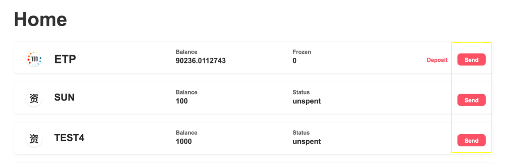
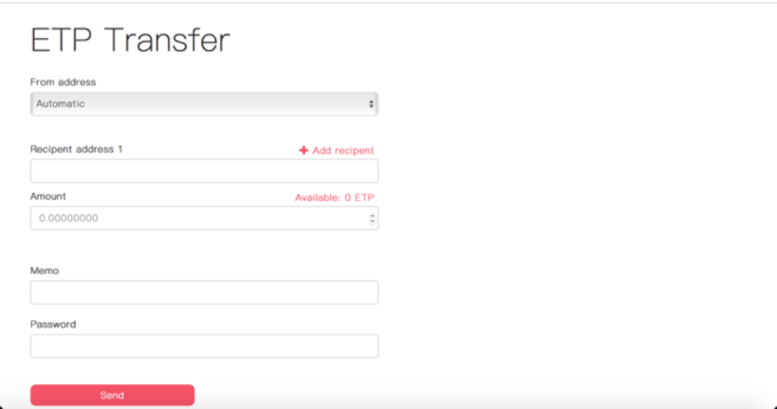

# Asset(token) Transfer

Click the “transfer” command shown next to your assets

## Home

Fill in transfer details such as the sending and receiving address, transfer amount, username and password, then click “confirm transfer”. You may adjust your transfer fee. The minimum miner reward for each transaction is 0.0001 ETP. Your transaction is likely to be confirmed more quickly if you set a higher miner fee.

## ETP Transfer

