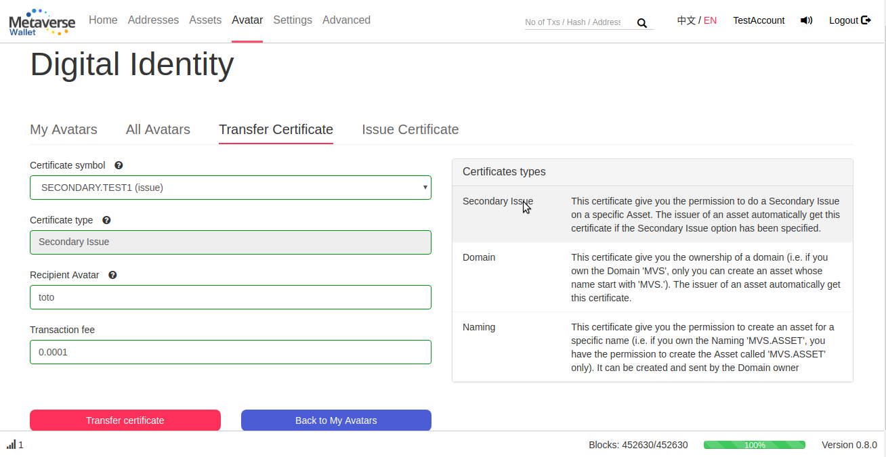
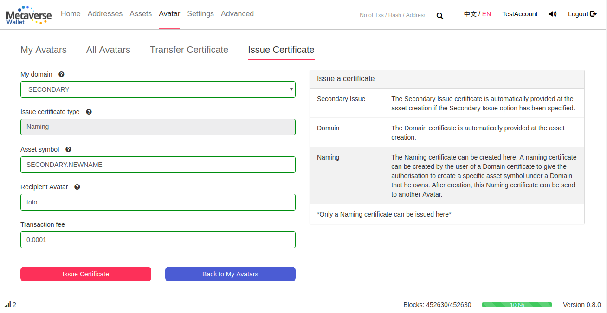
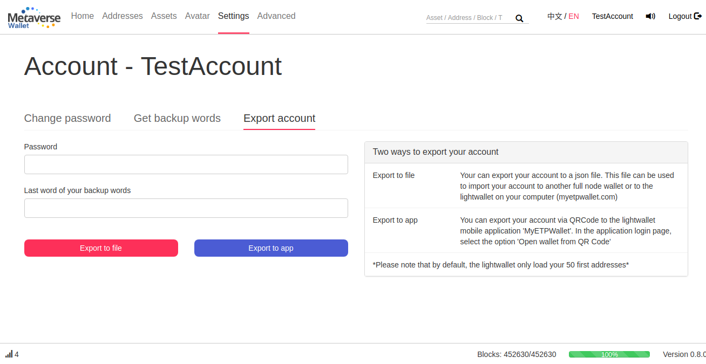
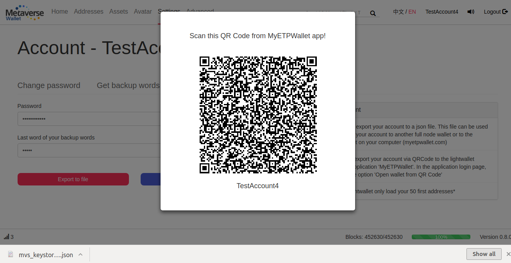

# Certificates

## Check your Certificates

You can see your certificates per Avatar in the Avatar main page. There is 3 types of certificates:

1. Secondary Issue: This certificate give you the permission to do a Secondary Issue on a specific Asset. The issuer of an asset automatically get this certificate if the Secondary Issue option has been specified.
2. Domain: This certificate give you the ownership of a domain (i.e. if you own the Domain ‘MVS’, only you can create an asset whose name start with ‘MVS.’). The issuer of an asset automatically get this certificate.
3. Naming: This certificate give you the permission to create an asset for a specific name (i.e. if you own the Naming ‘MVS.ASSET’, you have the permission to create the Asset called ‘MVS.ASSET’ only). It can be created and sent by the Domain owner.

## Transfer a Certificate

You can transfer any type of certificate from the ‘Transfer Certificate’ page

## Issue a Certificate

You can issue a certificate from the ‘Transfer Certificate’ page. Currently, only a Naming certificate can be issued since the Secondary Issue and Domain certificates are automatically generated at the Asset creation.

# Other

## Export Your Account to a File

You can export your account to a key file via the option ‘Export to file’. This file contains your backup words encrypted via your password.
It can be used to import your account to this wallet (full node wallet) on another computer or after an update for instance.
It is also compatible with the lightwallet [MyETPWallet](http://myetpwallet.com) and can be use to directly open your account in the lightwallet.

## Export your account to MyETPWallet app

To export your account to the mobile application, simply click on ‘Export to app’ and scan this QRCode via MyETPWallet app. This QR Code contains your backup words encoded via your password, so your password will be asked in the app in order to decrypt it.

