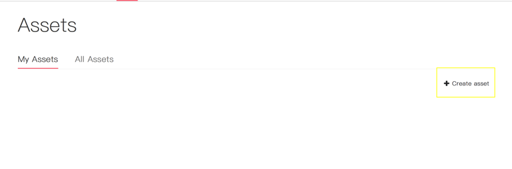
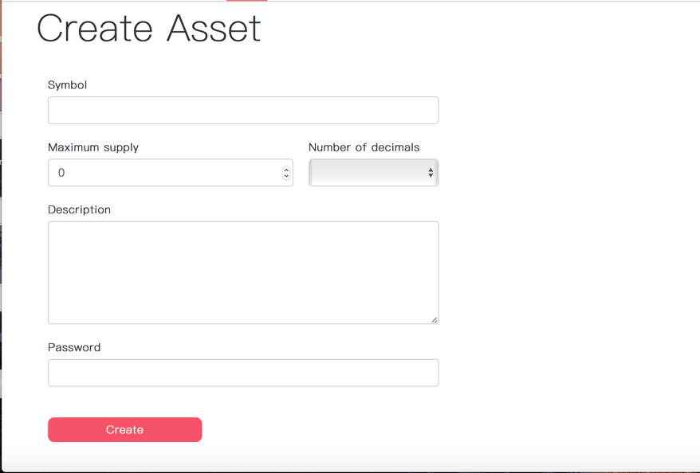
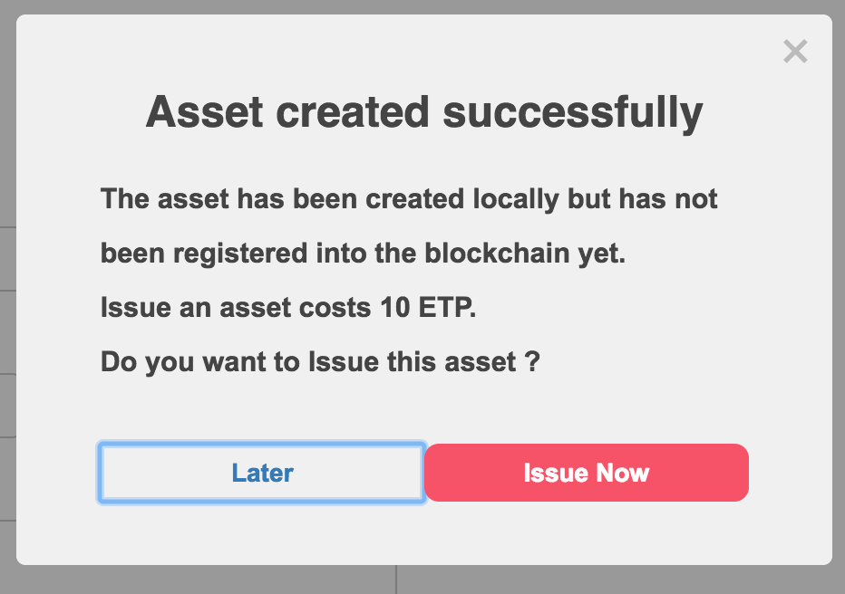
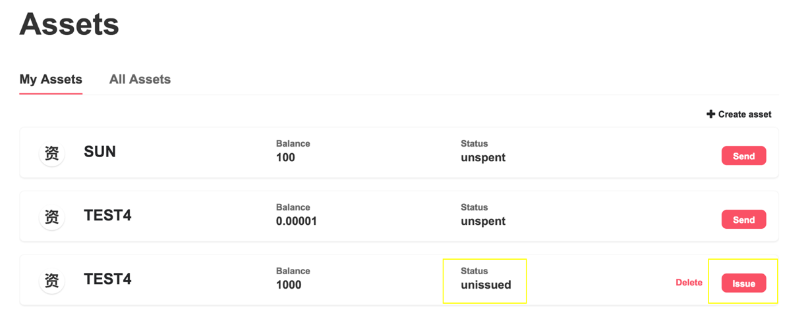

# Create And Issue Tokens

## Feature Description

Through just a few steps, you can create your own digital currency using the Metaverse Wallet. The Metaverse Blockchain allows you to register and issue digital assets, allowing you to digitize your assets and transfer value on a blockchain.

All digital currency issued on the Metaverse public blockchain can be viewed in the wallet, at “All Assets”.

## Create Assets

Enter the “Assets” page and click “Create asset” (marked in yellow below) to enter the asset creation page.

Please set the digital currency type, amount to be issued, decimal places and asset details, then click “Create Asset” to create your own digital asset.

Please note that assets are created locally and are not registered on the Metaverse Blockchain. No fees are charged to create an asset. Created assets will be displayed on the “My Assets” page.

## Assets

## Issue Assets

Assets issuance refers to the registration of your locally created assets on the Metaverse Blockchain, which consumes a 10 ETP service charge.

After clicking “Create Assets” in the previous step, a popup will appear asking if you wish to issue the asset. If you choose “Issue”, it will consume 10 ETP to register your assets on the Metaverse Blockchain.

If you do not issue the asset immediately after it is created, you can visit the “My Assets” page to view and issue the assets you created locally.

