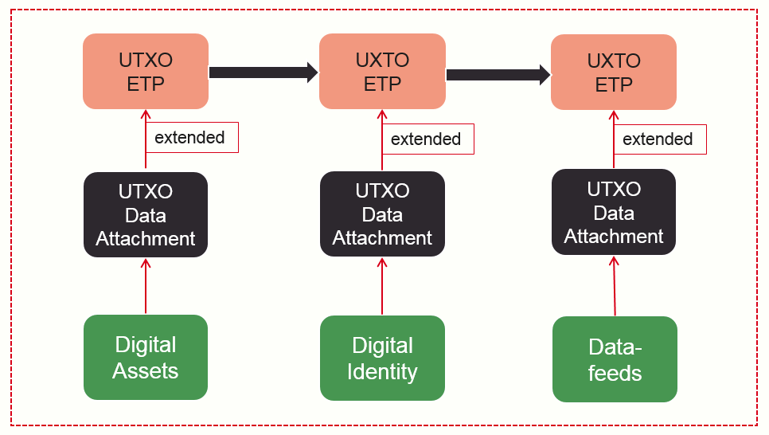
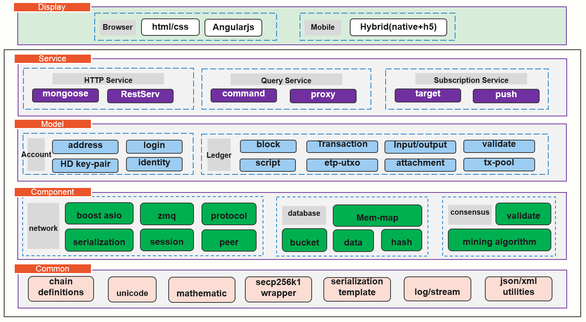
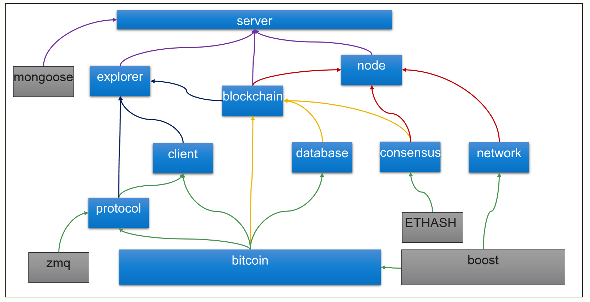

# Metaverse Overview

## Summary

The official implementation of MVS full node is [libbitcoin](https://github.com/libbitcoin) based, it means Metaverse is more close to bitcoin standard.

However, here are these differences:

1. Self-defining UTXO based smart tokens, which means users can issue their own token like what bitcoin does without any programming experience.
2. Self-defining UTXO based digital identity, aim to build a digital credit system through MVS blockchain.

As for Bitcoin, all UTXO only serves Bitcoin, but it does not restrict that the type of token must be specified. Thus, we extended this model design. We added the attachment field in the output which provides type extensions of MST so that all MST can have the same level of technical features as bitcoin without having to fork bitcoins to create their own tokens.

## UTXO Extensions

## Modifications

MVS is using [ETHASH](https://github.com/ethereum/ethash) which is actived on Ethererum mainnet for mining.
The JSON-RPC Server is based on [mongoose](https://github.com/cesanta/mongoose), which is a lignt embedded HTTP server.
To be listed…

## Full Node Architecture

## Compiling dependency

We intergrated 9 libbitcoin modules： [libbitcoin](https://github.com/libbitcoin/libbitcoin-system), [libbitcoin-explorer](https://github.com/libbitcoin/libbitcoin-explorer), [libbitcoin-database](https://github.com/libbitcoin/libbitcoin-database), [libbitcoin-blockchain](https://github.com/libbitcoin/libbitcoin-blockchain), [libbitcoin-server](https://github.com/libbitcoin/libbitcoin-server), [libbitcoin-network](https://github.com/libbitcoin/libbitcoin-network), [libbitcoin-protocol](https://github.com/libbitcoin/libbitcoin-protocol), [libbitcoin-node](https://github.com/libbitcoin/libbitcoin-node), [libbitcoin-consensus](https://github.com/libbitcoin/libbitcoin-consensus), into MVS full node with libbitcoin v2.
