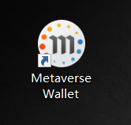
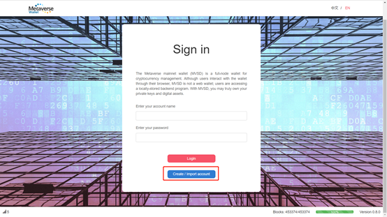
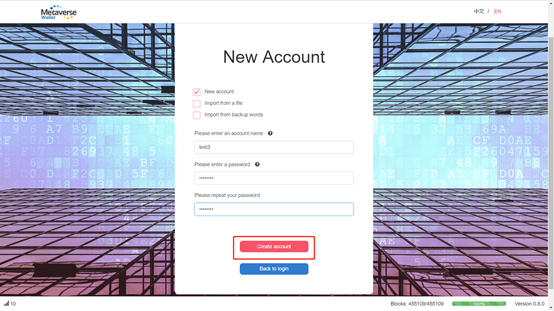
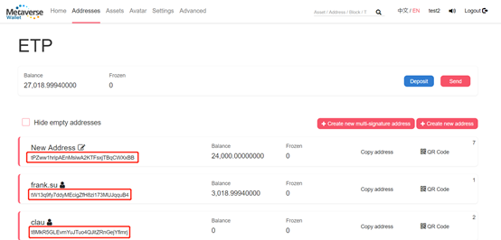
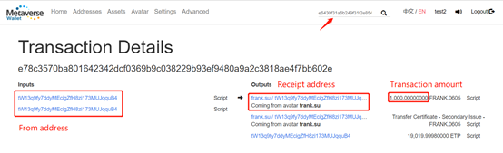
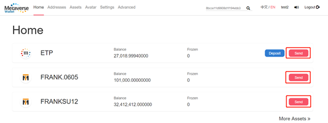

# Metaverse Wallet Setup

## Getting Started

The Metaverse full-node wallet is a cross-platform wallet program that operates trustlessly. It currently supports the Windows, Linux and MacOSX operating systems.

You may also use our light web wallet verified using SPV at [MyETPWallet](https://myetpwallet.com)

## Windows Download

#### Download

Please download the wallet installation package from Metaverse’s official website [mvs.org/wallet.html](https://mvs.org/wallet.html) The wallet is now support Windows 64bit system.

There are standard and data packet versions of the installation package. The packet version comes with a database, which greatly reduces the time required for initial block syncing. We recommend that new users download and install this version; existing users are recommended to install the standard version, because the packet version may overwrite some raw data. Please choose the appropriate installation package.

#### Install

Double-click the installation file and follow the prompts to complete installation. After the installation is complete, the wallet shortcut icon shows up on the desktop. Double-click the wallet icon to open it and enter the login page.

## MAC OSX Download

#### Download

Please download the wallet installation package from Metaverse’s official website [mvs.org/wallet.html](https://mvs.org/wallet.html). The wallet currently supports macOS Sierra and macOS High Sierra.

There are standard and data packet versions of the installation package. The packet version comes with a database, which greatly reduces the time required for initial block syncing. We recommend that new users download and install this version; existing users are recommended to install the standard version, because the packet version may overwrite some raw data. Please choose the appropriate installation package.

#### Install

Double-click the installation file and follow the prompts to complete installation. Click Launchpad to view the wallet program and double-click the wallet icon. Then, find the wallet icon in taskbar at the top of your screen and click the “Open Metaverse” command to enter the wallet login page.

## Quick start

### Register

After the installation is complete, the wallet shortcut icon shows up on the desktop.

Double-click the wallet icon to enter the login page and click “Create/ Import account”.
login

Set your account name and password, then click on “Create account”.
Create account

Write down the backup words and click “I understand” to complete registration.

### Receiving ETP

Open the wallet and click “address” at the top of the navigation bar to view your receiving addresses. Any of the addresses in your wallet can be used to receive digital currencies developed on the Metaverse public blockchain. You may choose any one of your wallet addresses as the receiving address.

### Query transaction hashs

Metaverse Wallet provides a portion of the block explorer’s functions. Users can inquire about blocks, transactions or the details of an address through querying the block’s serial number, the transaction hash and the address respectively. Each transaction produces a hash. You may view a transaction’s details via querying its transaction hash.

### Sending ETP

Click the “transfer” command shown next to your assets.

Fill in transfer details such as the sending and receiving address, transfer amount, transaction fee and message, then click “Send”.
Send

After double-confirm the transaction summary, enter password and click “Send” to complete the transaction.
Confirm

