# MST (Assets)

## Create An MST

From Supernova, a MST can only be issued from an Avatar, so please make sure to create an avatar first. It is also this Avatar that will receive the new MST created.

You now have the option to do Secondary Issue in the future. If you select this option, you, as owner and creator of this MST, will receive a certificate giving you the permission to issue more of this MST in the future, and so increase its maximum supply.

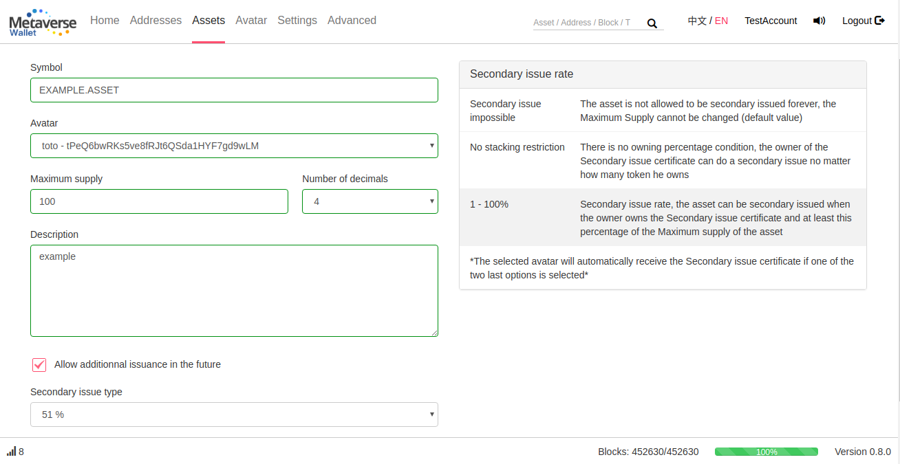

You can select the secondary issue rules between 3 types:

1. Secondary issue impossible: The MST is not allowed to be secondary issued forever, the Maximum Supply is fixed and cannot be changed. In that case, you will not receive any Secondary Issue certificate, since this option will not be available. This is the default option, and all the MSTs created before Supernova are in this category.
2. No stacking restriction: The issuer of the MST will receive the Secondary issue certificate that will give him the permission to do a secondary issue at any time, as often as he wants, no matter how many token he owns
3. 1 - 100%: This is the Secondary issue rate, the asset can be secondary issued only if the owner owns the Secondary issue certificate also owns at least this percentage of the Maximum supply of the MST

## Transfer an MST

Similarly to ETP, an Avatar can also be used as the recipient to send a MST.

You can also decide to freeze the asset, that you are sending to yourself or to someone else. Please note that at the opposite of ETP Deposit, freeze a MST does not generate an interest.

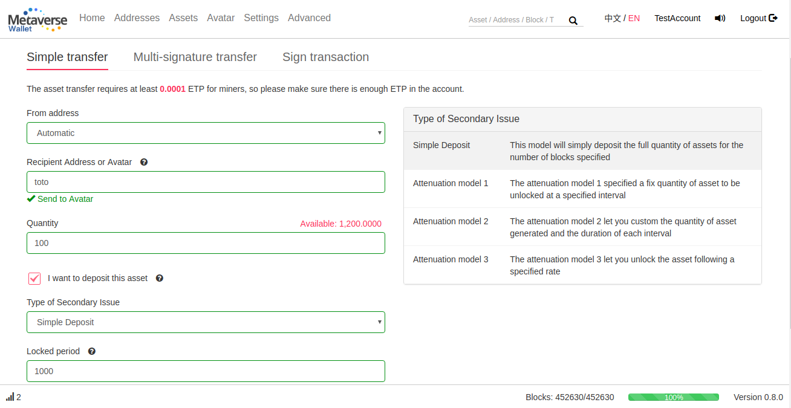

This option could for instance be used during an ICO for investors who would accept to have their MST frozen in exchange of a discount price to buy the MST.

You can also decide to use one of the Attenuation model, to gradually unlock the MST at a specified frequency.

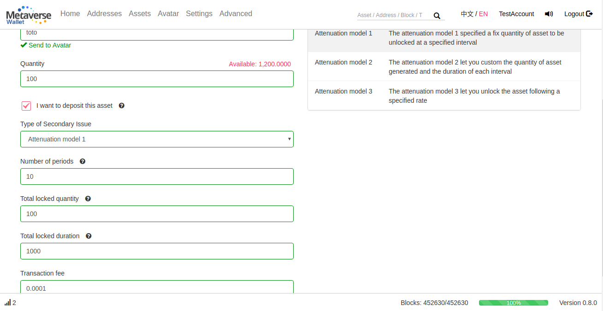

Please make sure the model used match your expectations in the confirmation.

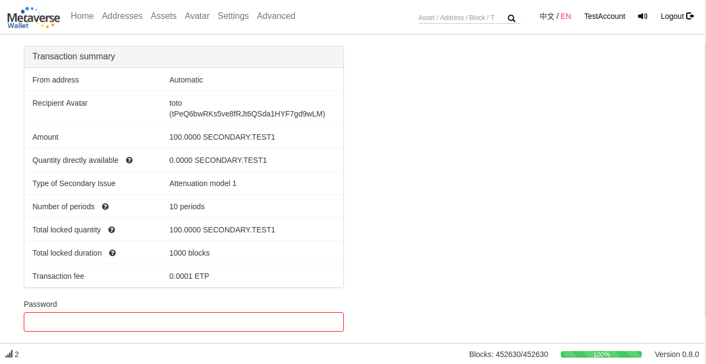

You can see your frozen balance of each MST in the ‘Home’ or ‘Assets’ page

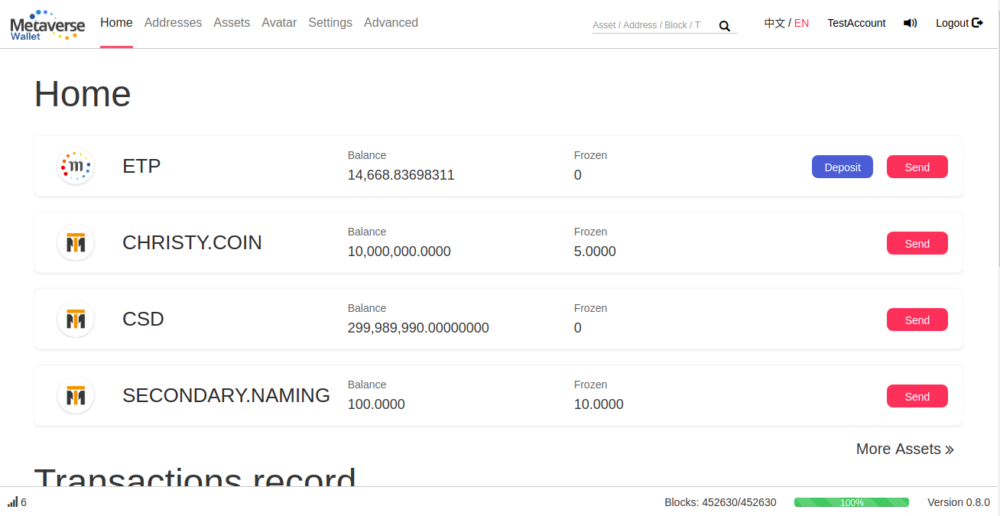

Note that you can now also use a multi-signature address to send and receive a MST.

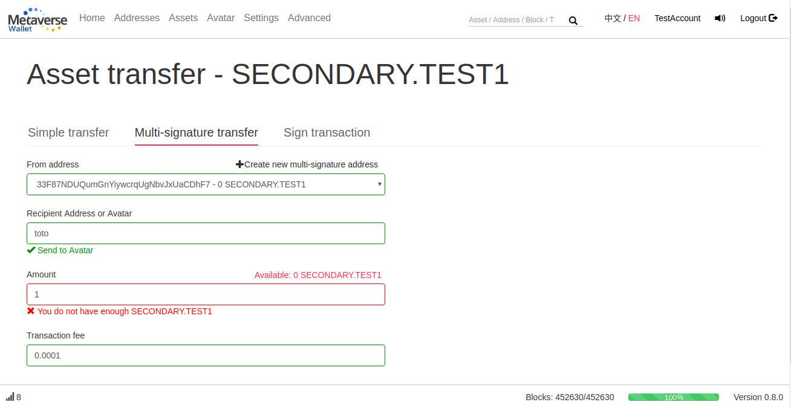

## Do a Secondary Issue

If you own the Secondary Issue certificate of an MST and match the required owning percentage (if specified at the asset creation), you can do a secondary issue by going to the MST page (click on its symbol in the ‘Asset’ page, or search for its name in the search section of the top bar).

There, you can see the general information of this MST and click on Secondary Issue if the option has been specified.

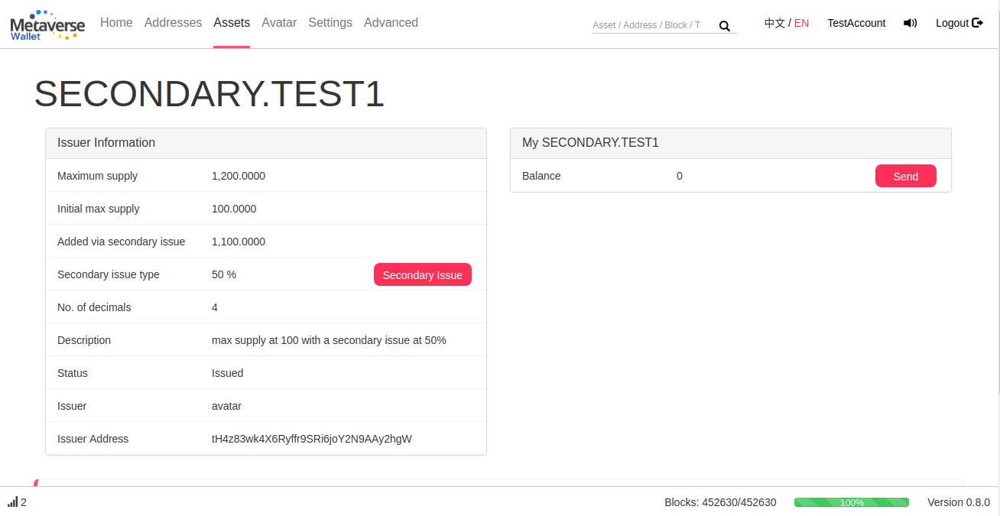

In the Secondary Issue page, you can specify which Avatar will receive the created MST and how many you want to issue. Please make sure to match the 3 conditions on the right:

1. You need to own the secondary issue certificate of this asset
2. The selected avatar needs to own at least the secondary issue threshold of this MST
3. The selected avatar needs to have enough ETP to pay the transaction fee (minimum 0.0001 ETP)

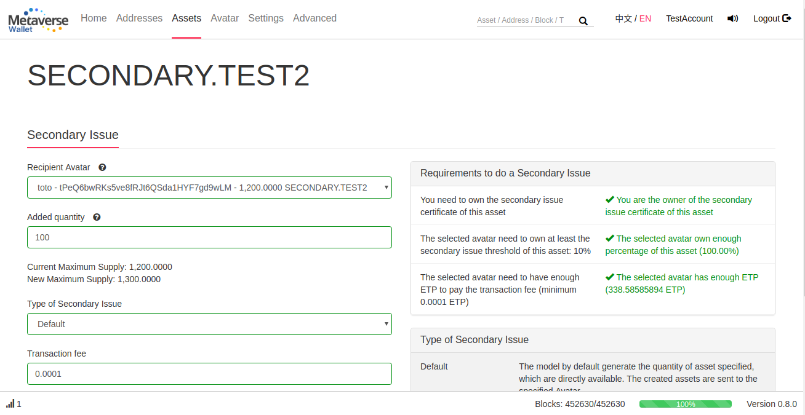

Similarly to a MST deposit, you can choose to freeze some of the created MST following one of the Attenuation model

Example with Attenuation model 1:

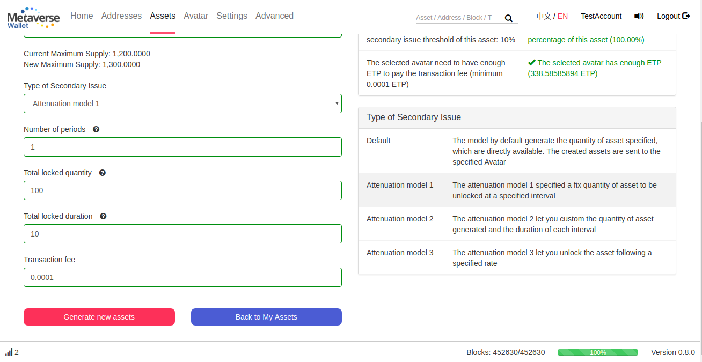

Example with Attenuation model 2:

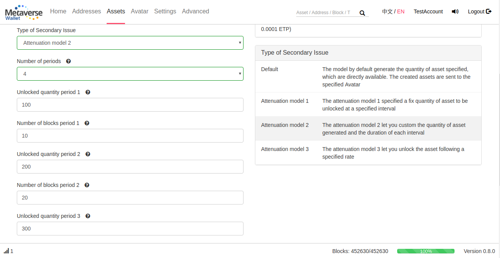

Always make sure in the confirmation page that the selected model match your expectations

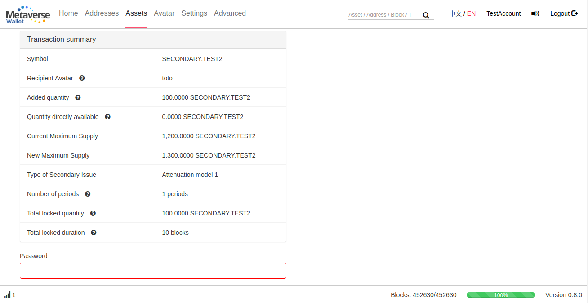
