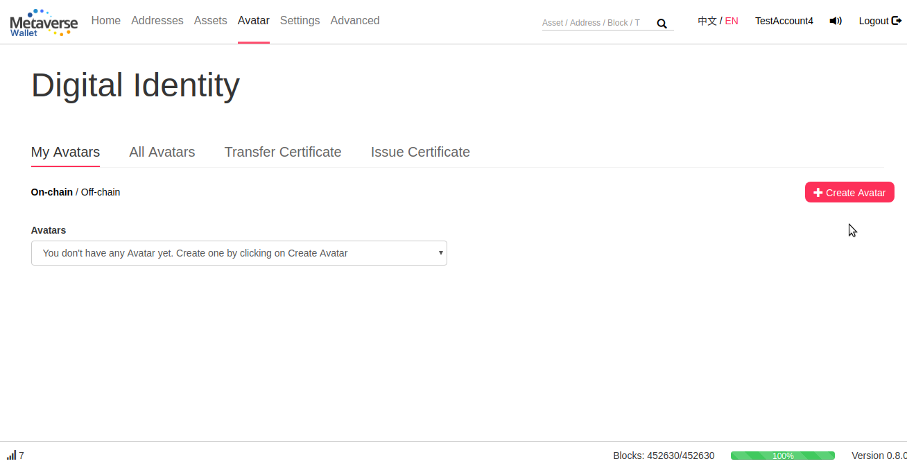
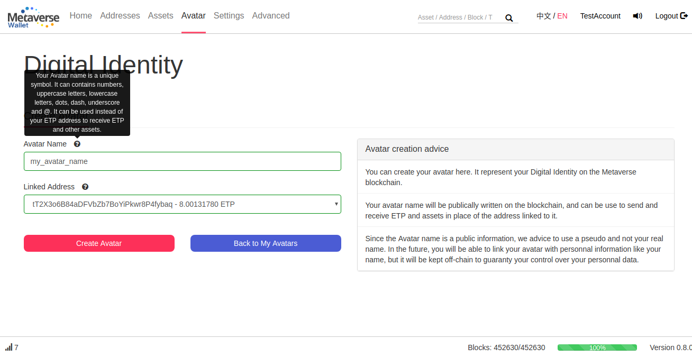
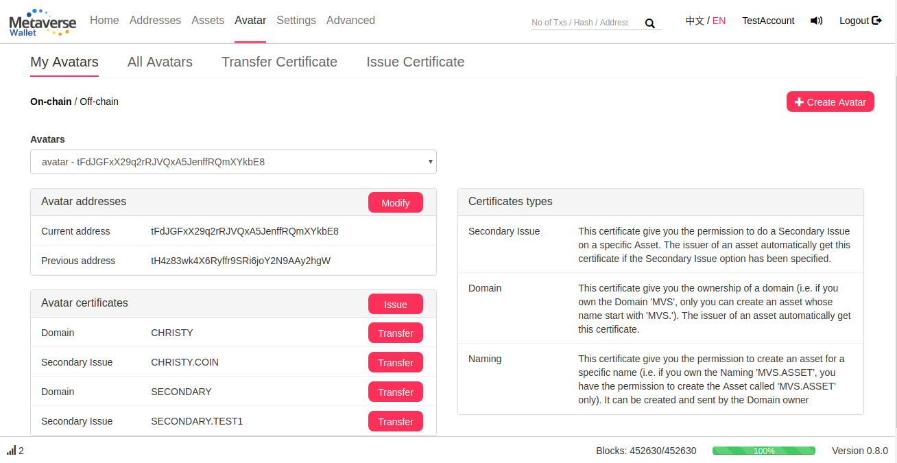
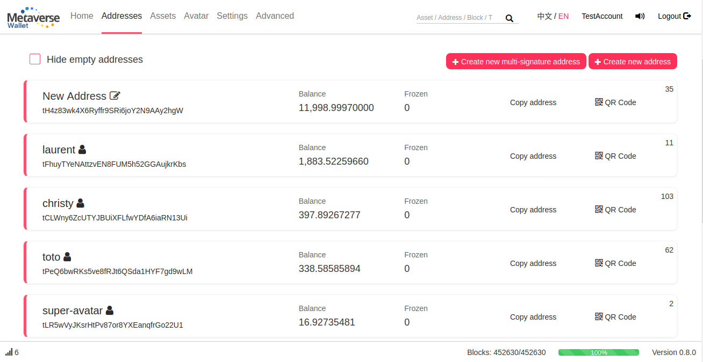
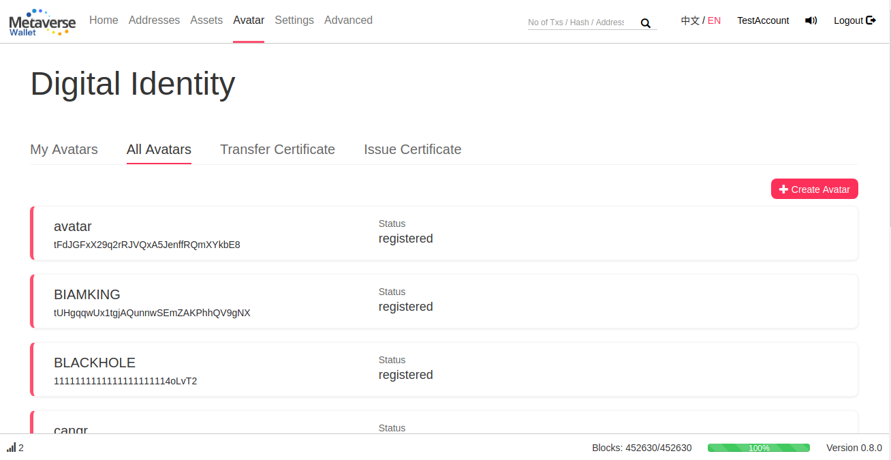
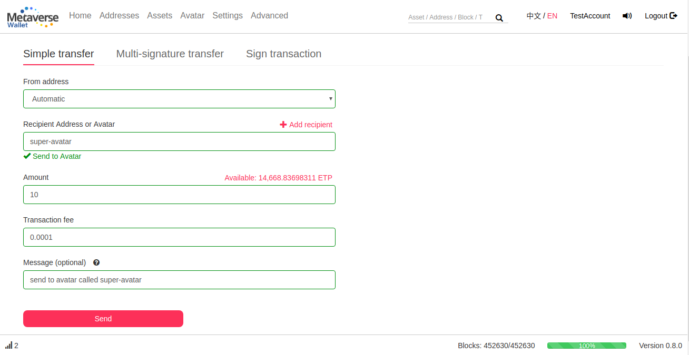
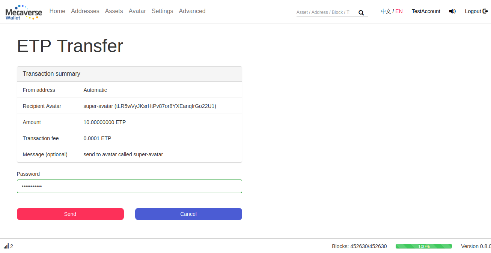

# Avatars

## Create An Avatar

The first main feature introduced by Supernova is the Digital Identity, that is called on Metaverse ‘Avatar’. To create an Avatar, simply go to the Avatar page, and click on Create Avatar

Choose an Avatar name and select the ETP address that will be linked to this address. Create an Avatar cost 1 ETP and this fee has to be payed with the selected address in order to prove that this address belongs to you. Please make sure to have at least 1 ETP on the selected address

Once created, you can see all your Avatars and their information (Address history and Certificates) in the Avatar main page

In the ‘Addresses’ page, you can easily recognize the addresses linked to an Avatar from the name and the logo associated

Finally, you can see all the Avatars created on the blockchain in the “All Avatars” page

## Use your Avatar

Your avatar can be used as a Recipient to send and receive ETP or MST. Simply type the Avatar’s name as the recipient, and it will be automatically detected as an Avatar if it is registered on the blockchain

On the confirmation page, you can see the address linked to this Avatar. You can double check this address in order to make sure your are sending your transaction to the right recipient

